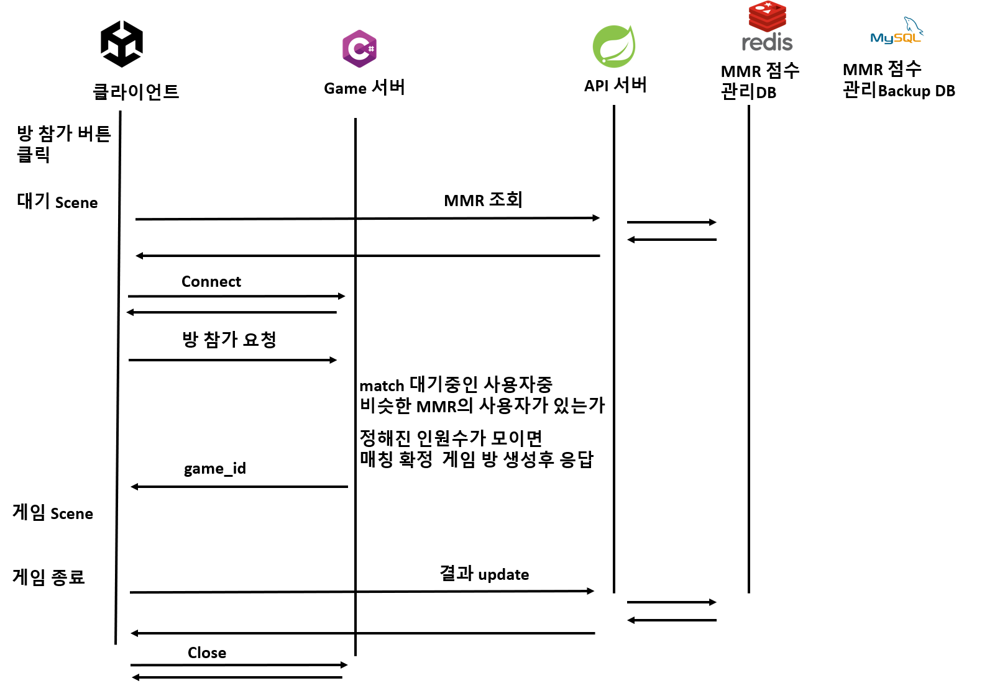

# 용어 정리
- MMR
    - Match Making Rating
    - 게임 실력을 나타내는 숫자 
    - 비슷한 사용자끼리 게임을 진행시키기 위해 사용
    - 승리시 상승, 패배시 하락한다

# 요구 사항
- 게임 참가 버튼을 눌렀을 때 비슷한 실력자들 끼리 같은 방에 참가 시키는 방법

# 고민 사항
- MMR 점수 관리
    - 순위표 조회
    - 사용자별 MMR 점수 조회 가능
    - 사용자별 MMR 점수 수정 가능
- 동시 요청 순차 처리
- 매칭 시스템 설계

# 매칭 시스템 설계

 
# 번외, Game Server의 game 관리
- GameServer는 packet을 받으면, 해당 패킷을 처리 할 수 있는 action을 관리 Dict에서 패킷 ID를 이용해 찾아 jobqueue에 넣는다
- game은 dict으로 관리, 주기적으로 for문을 돌며 모든 game에 Update호출
    - 서버의 Main에서 주기적 돌게끔 설정
- game의 Update 동작 내용
    - jobqueue에 action을 꺼내 실행
        - action 실행히, game에서 관리중인 객체 상태 변경
        - 변경 사항을 game과 관련한 player-client들에게 전송