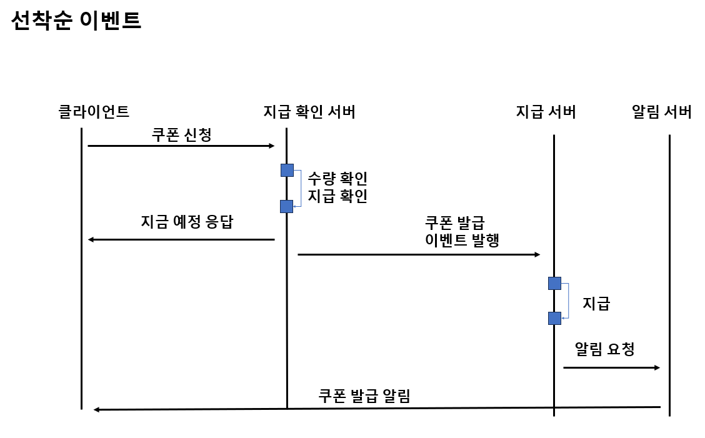
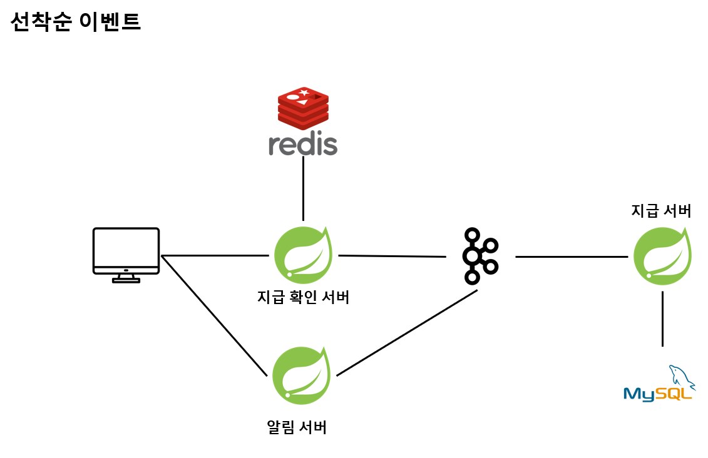

# 선착순 이벤트
## 요구 사항
- 특정 시간에 오픈
- 지급 수량이 한정
- 1인당 1장

## 해결






### Redis 활용
- 목적
    - 발급 확인 처리율 높이기
    - RDB 보다 빠른 Read 처리
- 선택 이유
    - set 자료구조 지원
    - 빠른 처리 속도
- 주의 사항
    - 동시성 문제

- 지급 관리 
    - set
    - key
        - "coupon:{coupon-id}:issued:users"
    - value
        - user id
- 발급 가능한 최대 수량
    - integer
    - key
        - "coupon:{coupon-id}:max-issued"
    - value
        - 쿠폰 발급 가능한 최대값

```
// 트랜잭션 시작

// 지급한 유저인지 확인

// 지급 관리 set 현재 size 조회 < 발급 가능한 최대 수량 확인

// 지급 관리 set add

// 트랜잭션 종료

// 지급 event 발행
```

### kafka 활용
- 목적
    - 발급 처리율 높이기
    - RDB Write 작업을 별도의 서버에서 비동기로 처리
- 주의 사항
    - 쿠폰이 지급 성광과 실제 발급 사이에 지연을 기획과 합의
- 발급 메세지
    - coupon id
    - user id
    - issuedAt


# reference
- 여기어때 기술 블로그, Redis&Kafka를 활용한 선착순 쿠폰 이벤트 개발기 (feat. 네고왕)
    - https://techblog.gccompany.co.kr/redis-kafka%EB%A5%BC-%ED%99%9C%EC%9A%A9%ED%95%9C-%EC%84%A0%EC%B0%A9%EC%88%9C-%EC%BF%A0%ED%8F%B0-%EC%9D%B4%EB%B2%A4%ED%8A%B8-%EA%B0%9C%EB%B0%9C%EA%B8%B0-feat-%EB%84%A4%EA%B3%A0%EC%99%95-ec6682e39731
