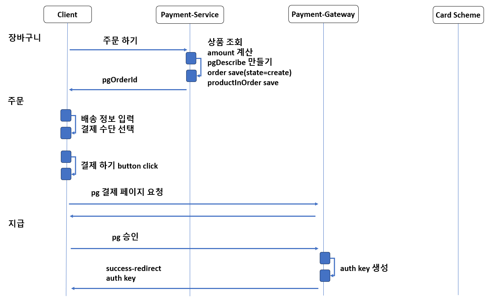
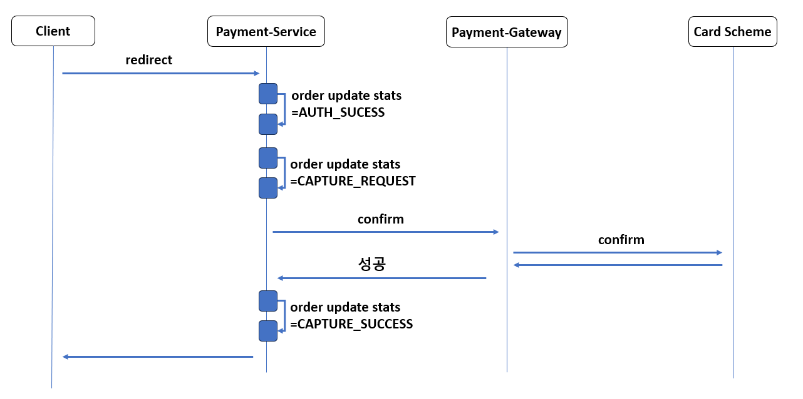
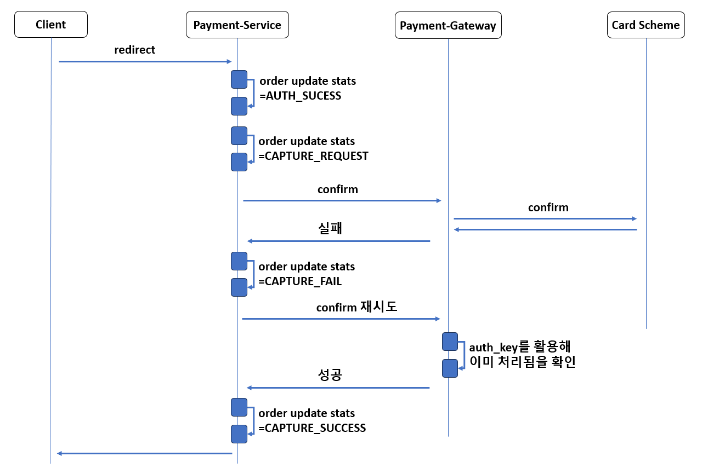

# 외부 API 호출
## 용어 정리

## 요구 사항
- 외부 API 요청시 처리는 제대로 되었으나 응답이 어떠한 이유로 실패할 경우 처리 방법
- 상황
    - 결제 처리시 PG사 호출

## 해결
### Auth-Capture Pattern
- 외부 API 요청시 처리는 제대로 되었으나 응답이 어떠한 이유로 실패할 경우, 재 요청을 보내도 처리가 다시 발생하지 않고, 처리 됨을 응답할 수 있는 아키택처

